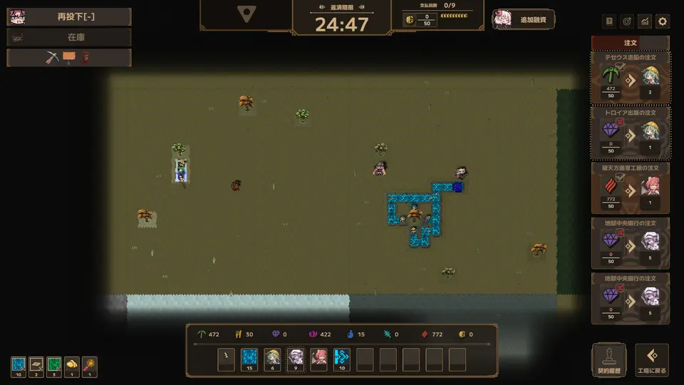
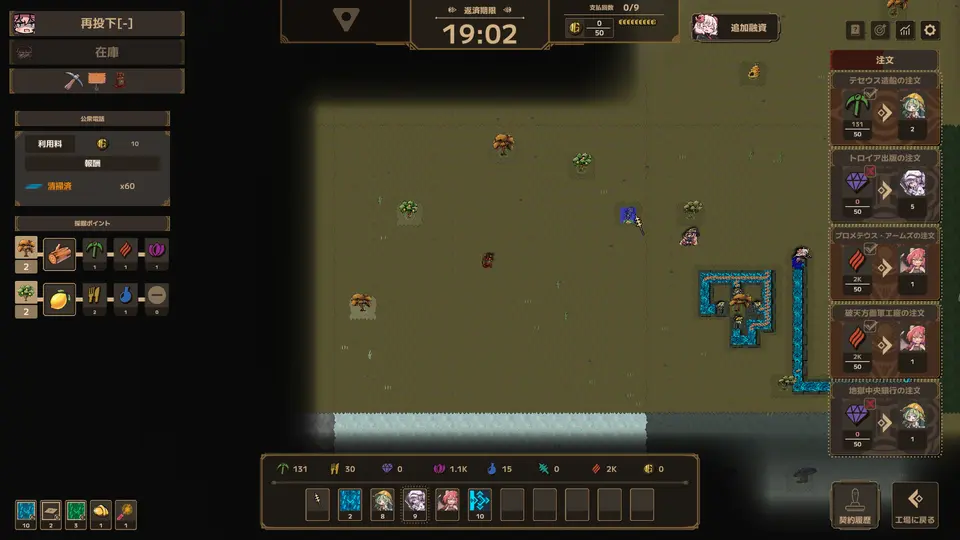

[日本語](README.md)

# LWF Raven QoL

A QoL mod for Delivery Ravens in **Lazy Witch's Factory**

**[Download the latest release](https://github.com/KiyonakaNata/lwf-raven-qol/releases/latest)** / **[Thunderstore](https://thunderstore.io/c/lazy-witchs-factory/p/KiyonakaNata/LwfRavenQol/)** (easy install with a mod manager)

---

## Features

### Drag placement

Place a Raven, drag, and release.

Pairs of "Dispatch Port + Raven" are placed at maximum carrying range, making transport lines quick to build.

What happens at the end depends on what is under the cursor when you release

| Released on | Result |
|---|---|
| An existing Dispatch Port | The Raven connects to it |
| A building with an input port (portal, water conveyor, crafter, ...) | A Dispatch Port is placed next to the input and connected |
| Anything else | A Dispatch Port is placed there (facing an adjacent input port, as the game's snap decides) |

Rocks, buildings and unowned land in the way are skipped by placing short of them. The drag stops only when nothing can be placed

- Out of Ravens ends the drag

### Auto placement

Place a Raven, then click a delivery spot beyond its carrying range.
Rocks, buildings and unowned land are avoided, and the line is laid for you.

### Retarget a Raven

Point at a placed Raven and press the key bound to **"Toggle Dispatch Port Setup"** (default Tab)

- Click → place a new Dispatch Port there
- Click an existing Dispatch Port in range → share it
- Drag → lay a new line from that Raven
- Press the same key again or R-Click → cancel (the Raven keeps its current target)

The old Dispatch Port **stays**, and leftover items can be taken out with conveyors.

A Dispatch Port that still holds items also stays when its Raven is removed. It does not disappear on its own once empty; right-click it to remove it.
If the Raven is mid-flight, it returns home, reloads, and heads for the new target.

### See what's inside

Point at a Raven or a Dispatch Port to see what it holds, as "icon × count"

- Dispatch port: items not yet carried out
- Raven: items in hand plus items in transit
- Up to 8 kinds, largest first; the rest shows as `+N`

### Map view

Three buttons sit at the top left

| Button | What it does |
|---|---|
| Redeploy | Redeploy Momoko |
| Stock | Overlays "icon × count" badges on every Raven and Dispatch Port on screen |
| Three icons (pickaxe, signboard, phone) | Toggles the left-side panels (portal, signboard, telephone, mining points) |

The control hints and the development sponsor list are hidden. The wand panel shows while a wand skill is selected.

#### Half-tile stops

Adds "between tiles" to the map view's camera stops.

- Redeploy on a seam lands Momoko on the seam
- A seam stop is available only when the tiles on both sides (all four at a corner) are owned
- The left-side panels are hidden while on a seam
- Hold a movement key to keep moving

---

## Install (manual)

1. Install **BepInEx 5** — [releases](https://github.com/BepInEx/BepInEx/releases)
   - Download `BepInEx_win_x64_5.4.x.zip`
   - Extract it into the game folder (next to `LazyWitchsFactory.exe`)

     > **Where is the game folder?** (Steam)
     > Right-click the game in your library → Manage → Browse local files

2. Run the game once and quit, so that `BepInEx/plugins` is created
3. Put `LwfRavenQol.dll` from this mod's zip into **`BepInEx/plugins/`**
4. Start the game, place a Raven, then click a distant spot and confirm the line grows

## Uninstall

**This mod only**

- `BepInEx/plugins/LwfRavenQol.dll`
- Also delete `BepInEx/config/kiyonakanata.lwfravenqol.cfg` to remove settings

**BepInEx entirely** (stops all other mods too)

- The `BepInEx` folder
- `winhttp.dll`, `doorstop_config.ini`, `.doorstop_version` in the game folder

---

## Settings

`BepInEx/config/kiyonakanata.lwfravenqol.cfg` (created after running the game once)

**[1. Relay Chain]**

| Entry | Default | Values |
|---|---|---|
| Enabled | `true` | |

**[2. Retarget]**

| Entry | Default | Values |
|---|---|---|
| Enabled | `true` | |
| Keep the old Dispatch Port | `true` | `false` to let it disappear automatically |
| Keep a dispatch port that still holds items | `true` | `false` to let it disappear when its Raven is removed |

**[3. Stock Display]**

| Entry | Default | Values |
|---|---|---|
| Enabled | `true` | |
| Show map-view stock on entry | `false` | Initial state of the Stock button |

**[4. Map View]**

| Entry | Default | Values |
|---|---|---|
| Enabled | `true` | |
| Hide control hints | `true` | |
| Stop at tile boundaries | `true` | `false` for tile centers only |

---

## Requirements

| | |
|---|---|
| Lazy Witch's Factory | Tested on **ver 0.27.0** |
| BepInEx | Tested on **5.4.23.5** (any 5.4.x should work) |

If a game update breaks this mod, that is the end of its life — remove it.

## Troubleshooting

Check `BepInEx/LogOutput.log` first

| Log | State |
|---|---|
| No `[boot] LWF Raven QoL ...` line | **Not loaded** — check where the DLL is |
| Fewer than `patches=14` | **Some features inactive** — game version mismatch |
| `cannot read ...` | **Only the feature named in the log is off** — everything else still works |

**Bug reports** should include

- A screenshot
- `BepInEx/LogOutput.log`

---

## Disclaimer

- **Unofficial mod** — not supported by the developer
- Any issues, crashes, or save corruption while modded are at your own risk
- Made in accordance with the [official modding policy](https://store.steampowered.com/news/app/3971650/view/699897618302503133)

Source code is MIT licensed (screenshots in `img/` are captures of the game; rights belong to the developer)
