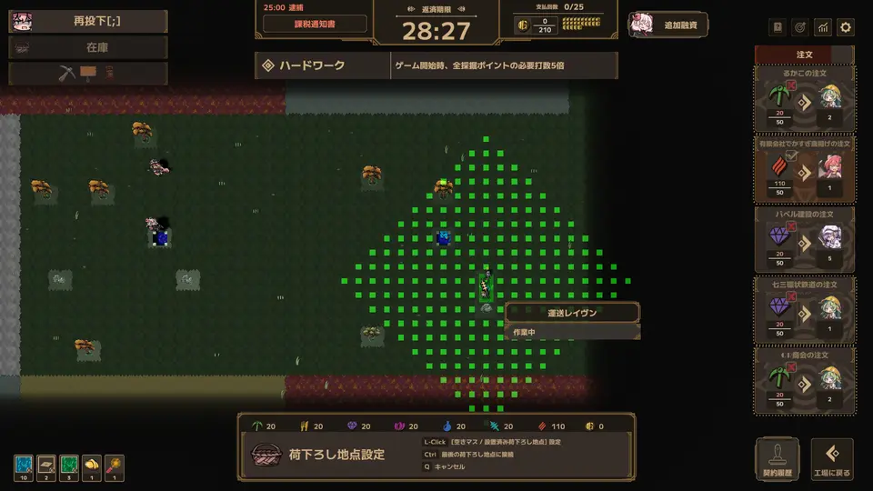
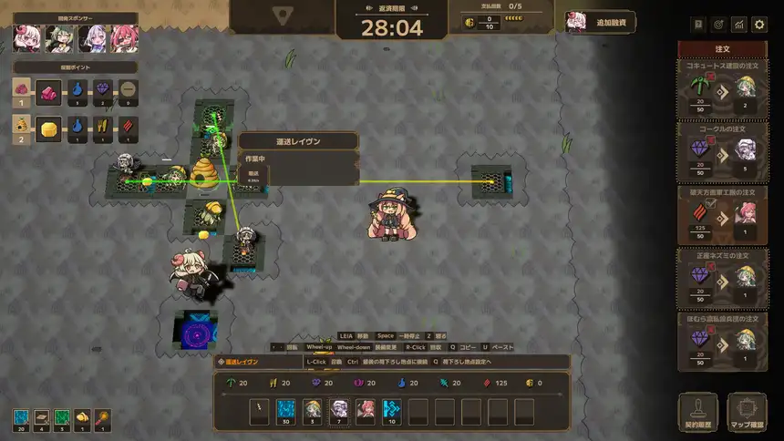
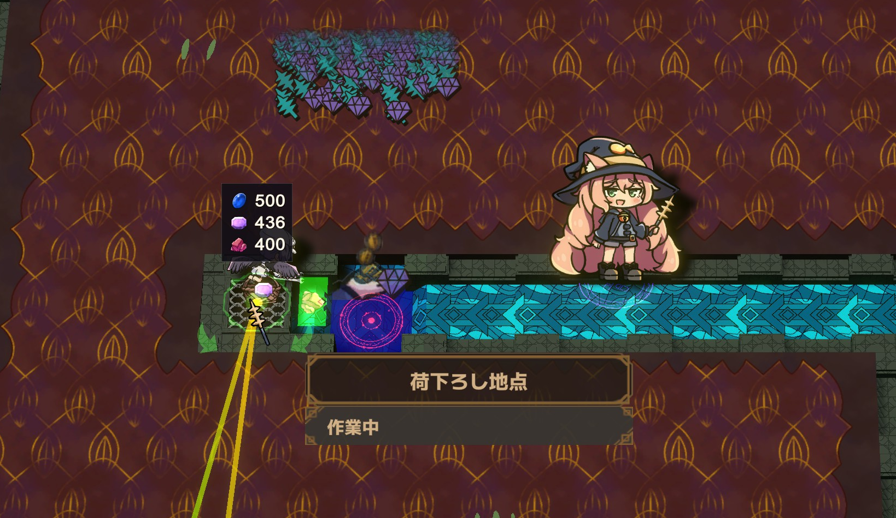
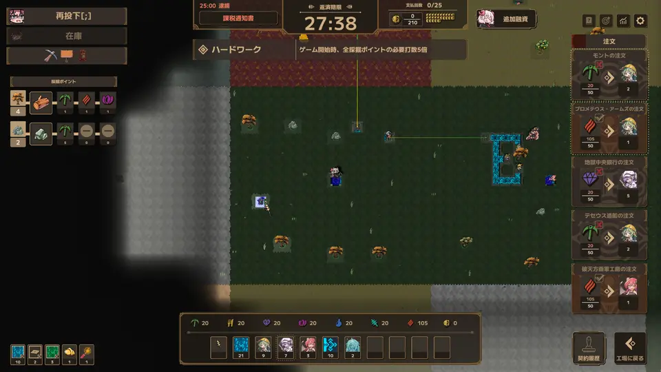

[English](README.en.md)

# LWF Raven QoL

**Lazy Witch's Factory** 運送レイヴンのQoL MOD

**[最新版をダウンロード](https://github.com/KiyonakaNata/lwf-raven-qol/releases/latest)** ／ **[Thunderstore](https://thunderstore.io/c/lazy-witchs-factory/p/KiyonakaNata/LwfRavenQol/)**（MOD管理ソフトでお手軽導入）

---

## できること

### ドラッグ敷設

レイヴンを置いて、そのままドラッグして、離すだけ

運搬範囲いっぱいの間隔で「荷下ろし地点＋レイヴン」が並び、運搬線の設置がお手軽に

ドラッグを終えた位置で終わりかたが変わる

| 離した位置 | 終わりかた |
|---|---|
| 既にある荷下ろし地点 | そこを行き先にする |
| 入力口を持つ設備（ポータル・水路・工房など） | 入力口の隣に荷下ろし地点を置いて接続 |
| それ以外 | その位置に荷下ろし地点を設置 |

次のどれかに当たるとドラッグは打ち止め

- レイヴンの在庫切れ
- 未購入の土地・埋まっているマス

### 配送先の変更

配置したレイヴンにカーソルを合わせ、キーコンフィグの**「荷下ろし地点設定切り替え」**（既定 Tab）を押す

- クリック → その位置に新しい荷下ろし地点を設置
- 範囲内の荷下ろし地点をクリック → そこを共有
- ドラッグ → そのレイヴンから線を敷き直す
- もう一度同じキーか右クリック → 変更をやめる（レイヴンは元の配送先のまま）

#### 備考

- 元の荷下ろし地点は**残り**、残った荷はコンベア等で取り出し可能
- 運搬中に切り替えた場合、レイヴンは一旦持ち場へ戻り、新たな荷を加えてから新しい地点へ向かう

### 中身の表示

レイヴンや荷下ろし地点にカーソルを合わせると、抱えている荷が「アイコン × 個数」で出る

- 荷下ろし地点 … 未搬出の荷
- レイヴン … 手元の荷と運搬中の荷
- 多い順に最大8種類、それ以上は `+N`

### マップビュー

画面の左上にボタンが3つ並ぶ

| ボタン | 何が起きるか |
|---|---|
| 再投下 | モモコの再投下 |
| 在庫 | 画面内のレイヴン・荷下ろし地点全てに「アイコン × 個数」の札を重ねる |
| アイコン（ツルハシ・看板・電話） | 左のUI（ポータル・看板・電話・採掘ポイント）の表示ON/OFF |

操作説明と開発スポンサーの表示は常に非表示

---

## 入れかた（手で入れる場合）

1. **BepInEx 5** を入れる — [配布元](https://github.com/BepInEx/BepInEx/releases)
   - `BepInEx_win_x64_5.4.x.zip` を落とす
   - 中身をゲームのフォルダ（`LazyWitchsFactory.exe` と同じ場所）へ展開する

     > **ゲームのフォルダの場所**（Steam）
     > ライブラリでゲームを右クリック → 管理 → ローカルファイルを閲覧

2. 一度ゲームを起動して終了すると、`BepInEx/plugins` などが作られる
3. このMODの zip の中の `LwfRavenQol.dll` を **`BepInEx/plugins/` に入れる**
4. ゲームを起動し、レイヴンを置いてドラッグで線が伸びることを確認する

## 消しかた

**このMODだけ消す**

- `BepInEx/plugins/LwfRavenQol.dll`
- 設定も消すなら `BepInEx/config/kiyonakanata.lwfravenqol.cfg`

**BepInEx ごと消す**（他のMODも全部止まる）

- `BepInEx` フォルダ
- ゲームのフォルダにある `winhttp.dll`、`doorstop_config.ini`、`.doorstop_version`

---

## 設定

`BepInEx/config/kiyonakanata.lwfravenqol.cfg`（ゲームを一度起動すると作られる）

見出しは cfg のセクション

**[1. Relay Chain] — ドラッグ敷設**

| 項目 | 既定 | 値 |
|---|---|---|
| Enabled | `true` | 機能ごとのオン・オフ |

**[2. Retarget] — 配送先の変更**

| 項目 | 既定 | 値 |
|---|---|---|
| Enabled | `true` | |
| Keep the old dispatch port | `true` | 元の荷下ろし地点を残す。`false` で自動で消える |

**[3. Stock Display] — 中身の表示**

| 項目 | 既定 | 値 |
|---|---|---|
| Enabled | `true` | |
| Show map-view stock on entry | `false` | 在庫ボタンの初期状態 |

**[4. Map View] — マップビュー**

| 項目 | 既定 | 値 |
|---|---|---|
| Enabled | `true` | |
| Hide control hints | `true` | 操作説明と選択物の説明を隠す |

---

## 動作の条件

| | |
|---|---|
| Lazy Witch's Factory | **ver 0.24.1** で作成・確認 |
| BepInEx | **5.4.23.5** で確認（5.4.x なら動くはず） |

本体の更新で動かなくなったら、このMODの寿命なので消すこと

## うまく動かないとき

まず `BepInEx/LogOutput.log` を見る

| ログ | いまどうなっているか |
|---|---|
| `[boot] LWF Raven QoL ...` が無い | **読まれていない** — DLL の置き場所を確認 |
| `patches=10` 未満 | **一部の機能が働かない** — ゲームの版が合っていない |
| `cannot read ...` | **ログが名指しした機能だけ止まっている** — ほかはそのまま使える |

**不具合の報告**には次の2つを添えること

- 画面の写真
- `BepInEx/LogOutput.log`

---

## 免責

- **非公式のMOD** — 公式のサポート対象外
- MODを入れた状態で起きた不具合・クラッシュ・セーブデータの破損などは自己責任
- [公式のMODに関する方針](https://store.steampowered.com/news/app/3971650/view/699897618302503133)に従って作成

ソースコードは MIT ライセンス（`img/` のスクリーンショットはゲーム画面の写しで、権利は開発元に帰属）
